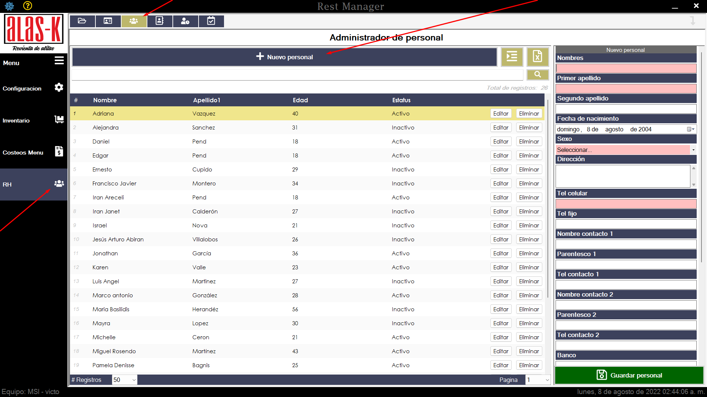
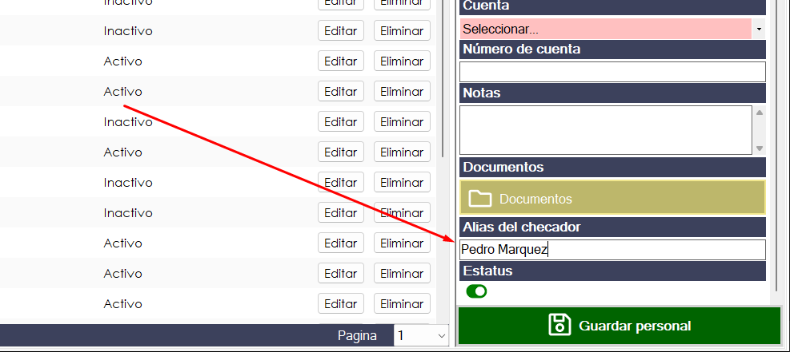
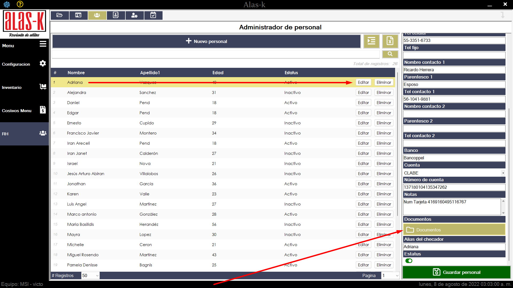
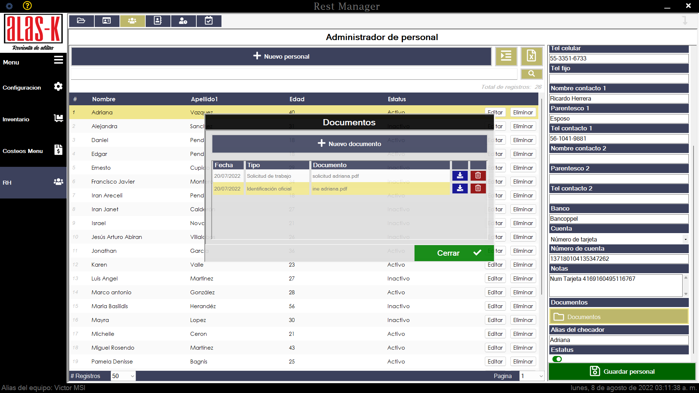

# Protocolo de nuevo ingreso

## Pasos urgentes desde su primer día.

1. Ingresar al sistema de Alas-k y crear un nuevo personal con los datos:
    * Nombre completo (urgente)
    * Fecha de nacimiento (urgente)
    * Sexo (urgente)
    * Dirección (urgente)
    * Tel Celular (urgente)
    * Tel Fijo (no urgente)
    * Contacto 1 (urgente)
    * Contacto 2 (no urgente)
    * Banco (urgente) (si no tienen, crear lo antes posible una cuenta)
    * Tipo de Cuenta (urgente)
    * Número de cuenta (urgente)

    

2. Es muy importante confirmar con supervisores el nombre que se dejo en el checador, e ingresarlo en el campo "Alias del checador", de lo contrario no va a calcular sus horas trabajadas y dejar el estatus como "Activo".
    
    

3. Guardar el personal en el sistema.

## Siguientes pasos

4. Dar seguimiento de la documentación en el sistema:
    * Acta de nacimiento
    * Comprobante de domicilio
    * Solicitud de trabajo o CV
    * Identificacion oficial
    * Rfc
    * CURP
    * NSS

    
    
